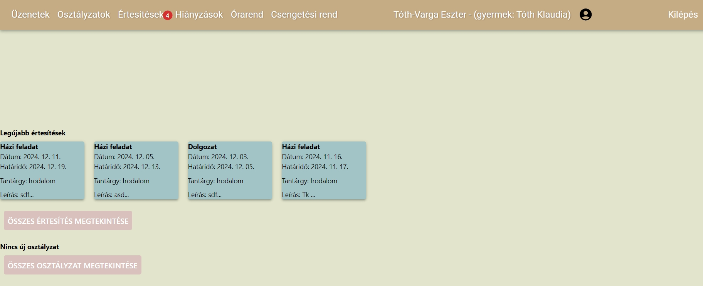
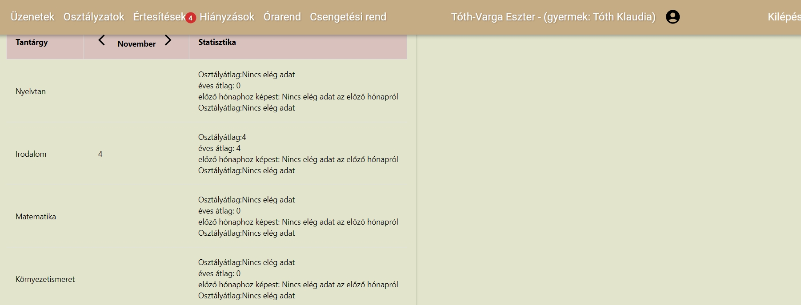
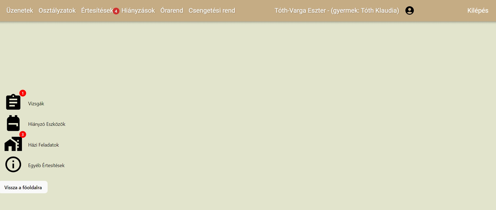
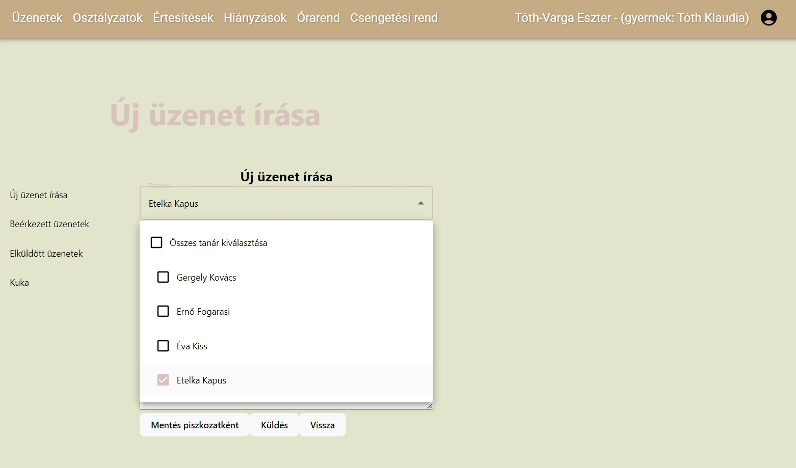
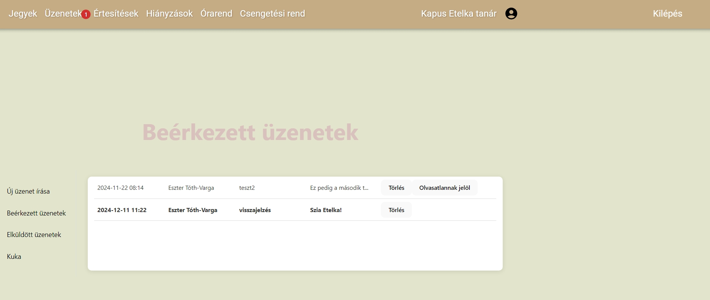

# Classroom Project

The goal of the Classroom project is to create a Kréta-like application. Primarily, this project was intended for practicing ASP.NET MVC projects, Entity Framework, and Identity. As a regular Kréta user, I found the task intriguing.

## Table of Contents
- [About The Project](#about-the-project)
- [Key Features](#key-features)
  - [Admin Capabilities](#admin-capabilities)
  - [Teacher Capabilities](#teacher-capabilities)
  - [Parent Capabilities](#parent-capabilities)
- [Built With](#built-with)
- [Usage](#usage)
- [Roadmap](#roadmap)
- [Contributing](#contributing)
- [Contact](#contact)

## About the Project
The goal of this project was to create an application with an admin section (for the school's administrator or principal), individual profiles for teachers, and profiles for parents. For each user type, I aimed to implement the basic functions in the most efficient and user-friendly way possible.

Switching between different schools or academic years is not supported, as these additional tasks were beyond the scope of what I deemed reasonable for this project.

## Key Features

### Admin Capabilities
- Add students, parents, and teachers to the database.
- Create classes.
- Create learning units consisting of teachers and classes.
- Currently, the admin does not have access to grades, but this feature is planned for future development.

### Teacher Capabilities
- Multiple gradebook views.
- User-friendly grade entry.
- Ability to send notifications and messages (including mass messaging).
- Receive confirmation of notification readings.

### Parent Capabilities
- View various statistics about grades.
- View new notifications and messages.
- 
## Built With
* [![React][React.js]][React-url]
* [![Backend][ASP.NET-Core]][ASP.NET-Core-url]
* [![Entity Framework][EF-Core]][EF-Core-url]
* [![SQL Server][MSSQL]][MSSQL-url]
* [![JWT][JWT]][JWT-url]

## Usage

Here are the screenshots of the application in action:
This is the main page of the parent, after login:

This is the grades-page of the parent:

This is the notifications-page of a parent:

This is the messages page of a parent, if they are sending a new message:

This is the messages page of a teacher:

## Roadmap
- Implement grade access for admins.
- Create an interface where teachers can record the material covered in each lesson, and where parents can access this information.
- Improve the user interface for better user experience.

[React.js]: https://img.shields.io/badge/React-61DAFB?logo=react&logoColor=black
[React-url]: https://reactjs.org/

[ASP.NET-Core]: https://img.shields.io/badge/ASP.NET_Core-5C2D91?logo=dotnet&logoColor=white
[ASP.NET-Core-url]: https://dotnet.microsoft.com/en-us/apps/aspnet

[EF-Core]: https://img.shields.io/badge/Entity_Framework_Core-9B85A8?logo=ef&logoColor=white
[EF-Core-url]: https://docs.microsoft.com/en-us/ef/core/

[MSSQL]: https://img.shields.io/badge/Microsoft_SQL_Server-CC2927?logo=microsoft-sql-server&logoColor=white
[MSSQL-url]: https://www.microsoft.com/en-us/sql-server

[JWT]: https://img.shields.io/badge/JSON_Web_Tokens-000000?logo=json-web-tokens&logoColor=white
[JWT-url]: https://jwt.io/

